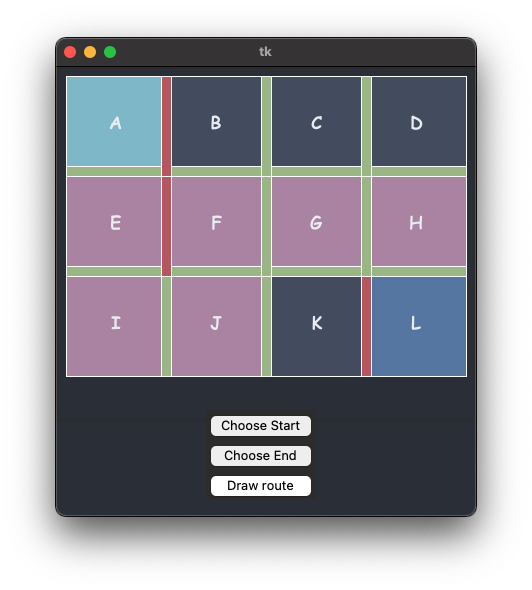

# qlearning-warehouse

Simple project visualizing Q-Learning algorithm imitating warehouse, where user can choose start and finish sectors for the robot to pick up packages as well as create walls between them.

